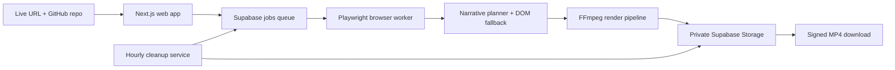

<div align="center">
  
  <h1>DemoBro</h1>
  <p><strong>Drop your links. We film the tour.</strong></p>
  <p>Generate a polished micro-demo video from a public web app and its GitHub repository—without manually recording your screen.</p>

  [](https://www.demobro.video)
  [](https://github.com/Hixly/DemoBro/actions/workflows/ci.yml)
  [](LICENSE)
</div>

> **Project status:** DemoBro is in a private beta. The hosted app is invite-only while its first-attempt tour quality is tested, but the source is open for inspection and contributions.

## What DemoBro does

DemoBro turns two links—a deployed web app and a public GitHub repository—into a short, branded MP4. It reads the repository for product context, explores the live interface with a browser worker, films meaningful interactions, and renders the result with captions, cursor treatment, transitions, and title/outro cards.

The project was born from [HackYard](https://hackyard.tech)'s **No Accounts** event theme. Its goal is to give makers a fast way to create submission-ready walkthroughs without requiring an account or a manual screen-recording session.

### First-attempt quality is part of the pipeline

DemoBro does not publish a title card followed by an empty landing page. Before a generated video can be uploaded, the browser tour must contain:

- at least three successful body beats;
- at least one real interaction, such as typing, clicking, or navigation;
- at least 12 seconds of body footage; and
- at least two visually distinct page states.

If the model cannot produce a complete tour, a generic DOM-driven fallback continues exploring the same site. The fallback looks for visible fields, primary actions, enabled-state changes, and result surfaces without product-specific selectors.

The renderer then samples the filmed frames to remove near-identical passive shots, avoids weak footer-style endings, and keeps the strongest product moment at the finish. A final media inspection verifies the MP4's body duration, beat count, streams, resolution, frame rate, and file integrity before upload.

## How it works



- **Web:** Next.js App Router interface and API routes for repository ingest, job creation, progress polling, and signed downloads.
- **Worker:** Node.js, Playwright, and FFmpeg service that discovers, records, evaluates, and renders each tour.
- **Data:** Supabase Postgres stores queue state; a private Storage bucket holds finished videos temporarily.
- **Cleanup:** An hourly service removes expired job rows and rendered files.

## Local development

### Prerequisites

- Node.js 22 or newer
- npm
- FFmpeg 8.x available on `PATH` for local rendering
- a Supabase project, or Docker for the local Supabase stack
- an xAI API key for narrative planning

### 1. Install dependencies

```bash
npm ci
npm ci --prefix worker
npm ci --prefix cron
```

The worker install downloads the matching Chromium build through Playwright.

### 2. Configure the environment

```bash
cp .env.example .env.local
```

Fill in the required values in `.env.local`. Never commit that file.

| Variable | Used by | Purpose |
| --- | --- | --- |
| `XAI_API_KEY` | web, worker | Narrative planning and replanning |
| `XAI_MODEL` | web, worker | Optional xAI model override |
| `NEXT_PUBLIC_SUPABASE_URL` | all services | Supabase project URL |
| `SUPABASE_SERVICE_ROLE_KEY` | all services | Server-only database and Storage access |
| `SUPABASE_STORAGE_BUCKET` | all services | Private finished-video bucket; defaults to `inbox` |
| `IP_HASH_SECRET` | web | HMAC secret used before storing request IP hashes |
| `BETA_GATE_ENABLED` | web | Enables the temporary shared-password beta gate |
| `BETA_PASSWORD` | web | Shared beta password; rotating it invalidates old cookies |
| `DEMOBRO_X264_CRF` | worker | Video quality; defaults to `18` |
| `DEMOBRO_X264_PRESET` | worker | x264 preset; defaults to `medium` |
| `DEMOBRO_FFMPEG_THREADS` | worker | Encoder thread cap; defaults to `1` |

The service-role key is privileged and must remain server-side. Do not rename it with a `NEXT_PUBLIC_` prefix or place it in browser code.

### 3. Prepare Supabase

DemoBro includes a migration for its `jobs` table. For a local stack:

```bash
npx supabase start
npx supabase db reset
```

For a linked remote development project, preview the migration before applying it:

```bash
npx supabase db push --dry-run
npx supabase db push
```

Create a **private** Storage bucket matching `SUPABASE_STORAGE_BUCKET` (the default is `inbox`). Finished videos are delivered with expiring signed URLs; the bucket does not need to be public.

### 4. Start the app and worker

Run these in separate terminals from the repository root:

```bash
npm run dev
```

```bash
npm run dev:worker
```

Open [http://localhost:3000](http://localhost:3000). The worker's development command reads the root `.env.local` automatically. The cleanup service can be exercised separately with `npm run dev:cron`.

## Useful commands

| Command | What it does |
| --- | --- |
| `npm run dev` | Start the Next.js development server |
| `npm run dev:worker` | Start the local job worker with `.env.local` |
| `npm run test` | Run deterministic worker quality tests |
| `npm run lint` | Lint the web app and Node services |
| `npm run build` | Create a production Next.js build |
| `npm run check` | Run lint, tests, and production build |
| `npm run brand:logo` | Regenerate the transparent web logo from the source asset |
| `npm run brand:favicon` | Regenerate the browser favicon from the DemoBro play logo |

## Deployment

The repository contains Dockerfiles and Railway service configuration for the web app, browser worker, and hourly cleanup service. Production requires the same secrets as local development, configured separately on the services that use them. The worker image pins both Playwright and FFmpeg so production renders match the tested runtime.

## Contributing

Bug reports, focused fixes, and improvements to tour reliability are welcome. Read [CONTRIBUTING.md](CONTRIBUTING.md) before opening a pull request. Please report security issues privately according to [SECURITY.md](SECURITY.md).

## License

DemoBro is available under the [MIT License](LICENSE).
